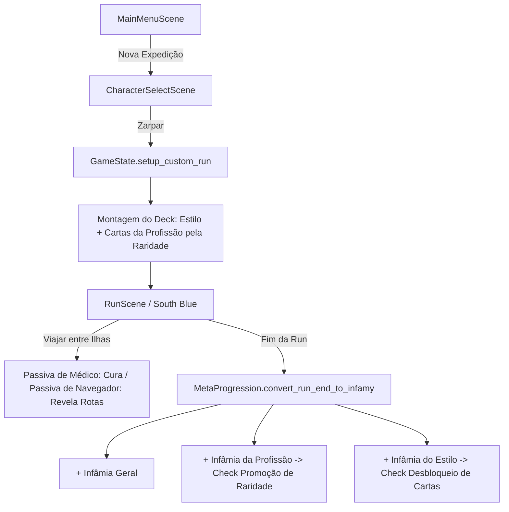

# Modelagem e Arquitetura: Estilos de Combate, Profissões & Maestria

Este documento estabelece as decisões de arquitetura e design para os sistemas de **Estilos de Combate** (classes iniciais), **Profissões do Capitão** e **Maestria de Carreira (Metaprogressão)** do *Grand Voyage Deckbuilder*.

---

## 1. Visão Geral e Filosofia de Design

O jogo adota uma separação clara entre **como o jogador luta** (Estilo de Combate) e **como o jogador viaja/opera no mar** (Profissão):

1. **Estilo de Combate (Classe/Arquétipo de Batalha):**
   - Paralelo direto a personagens como *Ironclad*, *Silent* e *Defect* de *Slay the Spire*.
   - Define a identidade tática em combate (cortes, dano bruto, cadência/compra, etc.).
   - Determina os atributos vitais de largada: `starting_hp`, `starting_gold`, `starting_food` e o `starter_deck` fixo.
   - **Progressão de Maestria:** Conforme o jogador acumula Infâmia jogando com um Estilo, ele desbloqueia novas cartas temáticas de raridades maiores (Incomum, Rara e Lendária) para serem encontradas e utilizadas.

2. **Profissão do Capitão (Habilidade Náutica & Arsenal Específico):**
   - Define a função do capitão dentro do bando (Navegador, Médico, Combatente, Cozinheiro, etc.).
   - Cada profissão carrega uma **habilidade passiva utilitária** (com exceção do *Combatente*, que compensa a ausência de passiva com um lote massivo de 5 cartas de combate).
   - **Progressão de Raridade:** Conforme o jogador acumula Infâmia jogando com a Profissão, a raridade da sua profissão sobe permanentemente (`common` ➔ `uncommon` ➔ `rare` ➔ `legendary`).
   - A raridade determina a qualidade/quantidade das cartas adicionadas ao baralho inicial e a potência da passiva.

---

## 2. Estrutura de Dados (Data-Driven)

Todos os conteúdos residem em JSONs na pasta `res://data/`, sem subclasses de script individuais para estilos ou profissões.

### A. Estilos de Combate (`res://data/combat_styles/combat_styles.json`)
```json
{
  "swordsman": {
    "id": "swordsman",
    "name": "Espadachim",
    "title": "Caminho da Lâmina",
    "description": "Mestre da esgrima naval e dos cortes precisos.",
    "starting_hp": 72,
    "starting_gold": 10,
    "starting_food": 5,
    "starter_deck": [
      "strike_basic", "strike_basic", "strike_basic", "cutlass_slash",
      "defend_basic", "defend_basic", "defend_basic", "second_wind"
    ]
  }
}
```

### B. Profissões (`res://data/professions/professions.json`)
```json
{
  "navigator": {
    "id": "navigator",
    "name": "Navegador",
    "description": "Especialista na leitura do clima e cartas náuticas.",
    "has_passive": true,
    "passive_name": "Visão da Rota Náutica",
    "passive_description": "Revela todas as rotas e conexões de todo o oceano.",
    "card_pool": {
      "common": ["map_reading", "quick_thinking"],
      "uncommon": ["favorable_wind", "sailors_gambit"],
      "rare": ["tempest_call"],
      "legendary": ["sea_chart_mastery"]
    }
  },
  "doctor": {
    "id": "doctor",
    "name": "Médico",
    "has_passive": true,
    "passive_name": "Tratamento de Travessia",
    "passive_heal_by_rarity": {
      "common": 5,
      "uncommon": 7,
      "rare": 10,
      "legendary": 15
    },
    "card_pool": {
      "common": ["first_aid", "field_medicine"],
      "uncommon": ["antidote_tonic", "kenbun_focus"],
      "rare": ["adrenaline_shot"],
      "legendary": ["miracle_panacea"]
    }
  },
  "combatant": {
    "id": "combatant",
    "name": "Combatente",
    "has_passive": false,
    "passive_name": "Sem Passiva Náutica",
    "card_pool": {
      "common": ["iron_punch", "guard_up", "cutlass_slash", "brace_impact", "strike_basic"],
      "uncommon": ["counter_strike", "sailors_gambit", "buso_strike", "tactical_feint"],
      "rare": ["heavy_impact", "axe_breaker"],
      "legendary": ["conquerors_roar"]
    }
  }
}
```

---

## 3. Regras de Adição de Cartas por Raridade da Profissão

Ao iniciar uma nova expedição, o baralho é composto por:
$$\text{Baralho Inicial} = \text{starter\_deck(Estilo)} + \text{Cartas Sorteadas(Profissão, Raridade)}$$

### Tabela de Cartas da Profissão:
| Raridade do Capitão | Combatente (Sem Passiva) | Demais Profissões (Com Passiva) |
| :--- | :--- | :--- |
| **Comum** | 5 cartas Comuns | 1 carta Comum |
| **Incomum** | 3 cartas Comuns + 2 Incomuns | 1 carta Comum + 1 Incomum |
| **Raro** | 3 cartas Incomuns + 2 Raras | 2 cartas Incomuns + 1 Rara |
| **Lendário** | 3 cartas Raras + 2 Lendárias | 2 cartas Raras + 1 Lendária |

---

## 4. Regras de Maestria & Metaprogressão

A cada final de expedição (seja por naufrágio ou por vitória sobre o chefe), a Infâmia ganha é atribuída cumulativamente a:
1. **Saldo de Infâmia Geral** (para compras na Loja Notória de Tripulantes e Frutas).
2. **Infâmia da Profissão Utilizada** (para subir a raridade daquela profissão).
3. **Infâmia do Estilo de Combate Utilizado** (para subir o nível de maestria daquele estilo).

### Tabela de Metas de Infâmia:

#### A. Evolução de Raridade das Profissões
- **Comum**: 0 Infâmia (largada padrão).
- **Incomum**: 300 Pontos de Infâmia acumulados na profissão.
- **Raro**: 900 Pontos de Infâmia acumulados na profissão.
- **Lendário**: 2.000 Pontos de Infâmia acumulados na profissão.

#### B. Níveis de Maestria dos Estilos de Combate
- **Nível 1 (0 pts):** Baralho base básico desbloqueado.
- **Nível 2 (250 pts):** Desbloqueia novas cartas de combate **Incomuns** associadas ao estilo.
- **Nível 3 (700 pts):** Desbloqueia novas cartas de combate **Raras** associadas ao estilo.
- **Nível 4 (1.500 pts):** Desbloqueia novas cartas de combate **Lendárias** associadas ao estilo.

---

## 5. Fluxo de Execução e Componentes Envolvidos



---

## 6. Guia de Extensão para Futuras Adições

Para adicionar novos conteúdos no futuro mantendo compatibilidade total:

1. **Adicionar um Novo Estilo de Combate:**
   - Adicione uma entrada em `data/combat_styles/combat_styles.json` com `id`, `name`, `starting_hp`, `starting_gold`, `starting_food` e a lista de `starter_deck`.
   - Crie as cartas em `data/cards/cards.json` se houver golpes novos.
   - O `DataLoader`, a tela de seleção `CharacterSelectScene` e a persistência carregarão o estilo automaticamente.

2. **Adicionar uma Nova Profissão:**
   - Adicione uma entrada em `data/professions/professions.json` com `id`, `name`, `has_passive`, pools de cartas por raridade (`common`, `uncommon`, `rare`, `legendary`).
   - Se possuir efeito passivo em viagem ou evento, conecte a verificação em `run_scene.gd` (`apply_crew_travel_effects()`) ou no contexto correspondente.
